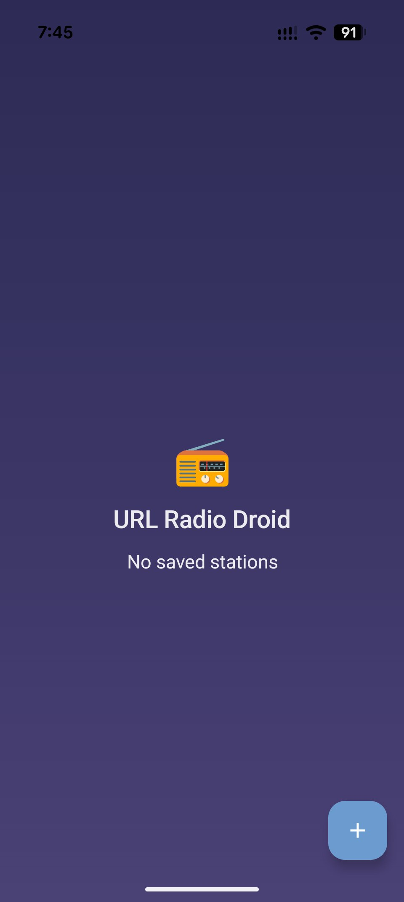
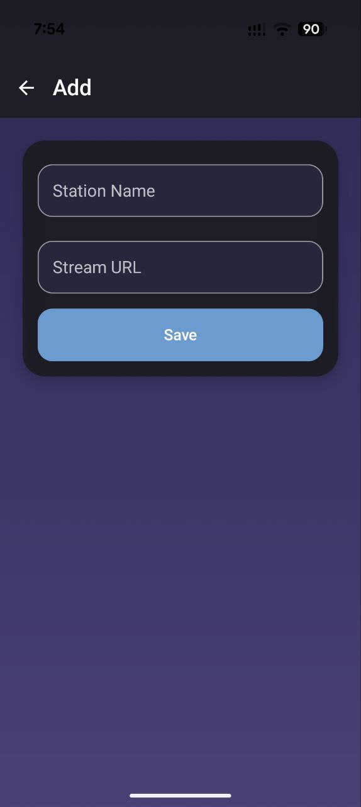

# 📻 URL Radio Droid

A minimalist Android application for listening to internet radio via direct streaming links (HTTP/HTTPS).

## 📸 Screenshots

<p align="center">
  
  
  
</p>

## ✨ Features

- 📍 Add radio stations with name and stream URL
- 📜 View list of saved stations with search (when more than 4 stations)
- ▶️ Play streams using ExoPlayer
- 🔇 Background playback support with media notifications
- **🎯 Unified player and list state**: the bottom mini player and the active list item always show the same station and play/pause state
- **🎵 Mini player**: always visible when a station is selected; play/pause; tap to open full playback screen
- **👆 Swipe to switch stations**: swipe left/right on the mini player to switch to previous/next station in the list; smooth slide animation
- **📊 Playback status**: Playing, Paused, Starting… (also when buffering), or Connection failed (after ~10 s if stream does not start, or immediately on invalid URL)
- **📡 HLS support**: `.m3u8` URLs are played via ExoPlayer’s HLS support (manifest + segments); no timeshift for HLS
- **⏪ Timeshift (rewind)**: for single-URL streams, rewind 5 seconds or jump back to live; live indicator shows when you are at the live edge
- **⚠️ Connection error handling**: invalid or unreachable stream URL shows "Connection failed" toast; app does not crash
- 💾 Local data storage using Room Database
- 🎨 Modern UI with Jetpack Compose (liquid glass style)
- 🌐 Network availability check before playback
- ✔️ URL validation when adding stations

## 📋 Requirements

- Android 10 (API 29) or higher
- Android Studio or compatible IDE
- Gradle 9.0+
- Java 24 (for compilation)

## 🔨 Building

1. Clone the repository or open the project in Android Studio
2. Sync Gradle dependencies
3. Build the project: `./gradlew build`
4. Install on device: `./gradlew installDebug`

## 📦 Releases

Installable APKs are published in the repo’s [Releases](releases) section when you push a version tag.

To publish a new release:

1. Create a version tag (e.g. `v1.0`):  
   `git tag v1.0`
2. Push the tag:  
   `git push origin v1.0`
3. On GitHub, open **Actions** — the **Release** workflow will run, build the APK, and create a release with the attached file `url-radiodroid-1.0.apk`.

Release APKs are currently built as debug (no separate keystore). For a signed release build, add a keystore via GitHub Secrets and adjust the workflow.

## 🚀 Usage

1. Launch the application
2. Tap the "Add" button (FAB)
3. Enter station name and stream URL (e.g. `http://stream.example.com:8000/stream` or `https://example.com/stream.m3u8` for HLS)
4. Tap "Save"
5. Tap a station in the list to play (or tap Play on a station card)
6. Use the bottom mini player: tap for full playback screen; use Play/Pause; swipe left/right to switch to previous/next station
7. **Timeshift** (single-URL streams only): while playing, use the rewind (↺ 5) button to go back 5 seconds; use the Live (●) button to return to the live edge; the Live indicator is bright when at live, dim when in the past
8. Playback continues in background with media notification

## ⏪ Timeshift (rewind)

While a stream is playing, the app records it to a temporary buffer file (default cap ~30 MB). Playback reads from this file, so you can rewind within the buffered range:

- **Rewind 5 s**: jumps back 5 seconds (by reopening the source at the corresponding byte offset; ExoPlayer does not reliably honour `seekTo(ms)` for live-style progressive sources).
- **Live**: jumps to the current end of the buffer (live edge). The Live indicator (●) is bright when at live, dim when in the past.

Buffer file is created in app cache and removed when playback stops. **Timeshift is not used for HLS** (`.m3u8`): those streams are played directly; rewind/Live buttons are hidden.

## 🛠 Technologies

- **Kotlin** - primary development language
- **Jetpack Compose** - UI toolkit
- **AndroidX** - support libraries
- **Room Database** - local database for stations
- **Media3 (ExoPlayer)** - audio stream playback; HLS (m3u8) and progressive; custom DataSource for timeshift buffer
- **OkHttp** - stream recording for timeshift (buffer file)
- **Coroutines & StateFlow** - state and async operations
- **KSP** - Room annotation processing
- **MediaSession** - integration with Android media playback system

## 📁 Project Structure

```
app/src/main/
├── java/com/urlradiodroid/
│   ├── data/
│   │   ├── RadioStation.kt          # Entity for radio station
│   │   ├── RadioStationDao.kt       # DAO for database operations
│   │   └── AppDatabase.kt           # Room database
│   ├── ui/
│   │   ├── MainScreen.kt            # Main screen (Compose) with list and mini player
│   │   ├── MainViewModel.kt         # State: stations, search, current playing station
│   │   ├── AddStationScreen.kt      # Add/edit station screen
│   │   ├── PlaybackScreen.kt        # Full playback screen
│   │   ├── RadioPlaybackService.kt  # Background playback service (timeshift, seek)
│   │   ├── playback/
│   │   │   ├── StreamRecorder.kt    # Records stream to buffer file (OkHttp)
│   │   │   └── LiveFileDataSource.kt # Media3 DataSource: read buffer, block at EOF
│   │   ├── components/
│   │   │   ├── NowPlayingBottomBar.kt  # Mini player: play/pause, rewind 5s, live
│   │   │   └── StationItem.kt          # Station list item (swipe to edit/delete)
│   │   └── theme/                   # Compose theme (colors, typography)
│   └── util/
│       └── EmojiGenerator.kt
└── res/
    ├── values/                      # Strings, colors, themes
    └── drawable/                    # Icons
```

## 📚 Dependencies

Main project dependencies:

- `androidx.core:core-ktx:1.17.0`
- `androidx.appcompat:appcompat:1.7.1`
- `com.google.android.material:material:1.13.0`
- `androidx.compose.*` - Compose BOM
- `androidx.room:room-runtime:2.8.4` + `room-ktx:2.8.4`
- `androidx.media3:media3-exoplayer:1.9.1`
- `androidx.media3:media3-exoplayer-hls:1.9.1` (HLS / .m3u8)
- `androidx.media3:media3-ui:1.9.1`
- `androidx.media3:media3-session:1.9.1`
- `androidx.media3:media3-datasource:1.9.1` (custom DataSource for timeshift)
- `com.squareup.okhttp3:okhttp` (stream recording for timeshift buffer)

## 🧪 Testing

The project includes unit tests for:

- **RadioStation** - data model equality and properties
- **RadioStationDao** - CRUD and ordering (in-memory database)
- **MainViewModel** - current playing station, search, delete
- **UrlValidator** - URL validation (AddStationActivity)

### Running Tests Locally

Run all unit tests:

```bash
./gradlew test
```

Run tests for a specific module:

```bash
./gradlew :app:test
```

View test results:

```bash
./gradlew test --info
```

Test results are available in `app/build/test-results/` directory.

## ✅ Code Quality

### Kotlin Linting (ktlint)

The project uses [ktlint](https://ktlint.github.io/) for code style checking and formatting.

Check code style:

```bash
./gradlew ktlintCheck
```

Auto-fix code style issues:

```bash
./gradlew ktlintFormat
```

## 🔄 CI/CD

GitHub Actions workflow automatically runs on every push and pull request:

- **Tests**: Runs all unit tests
- **Lint**: Checks Kotlin code style with ktlint
- **Build**: Builds the debug APK

View workflow status in the "Actions" tab of your GitHub repository.

## 🔐 Permissions

The application requests the following permissions:

- `INTERNET` - for stream playback
- `ACCESS_NETWORK_STATE` - for network availability check
- `FOREGROUND_SERVICE` + `FOREGROUND_SERVICE_MEDIA_PLAYBACK` - for background playback
- `POST_NOTIFICATIONS` - for media notifications (Android 13+)

## 📄 License

Project created for personal use.
