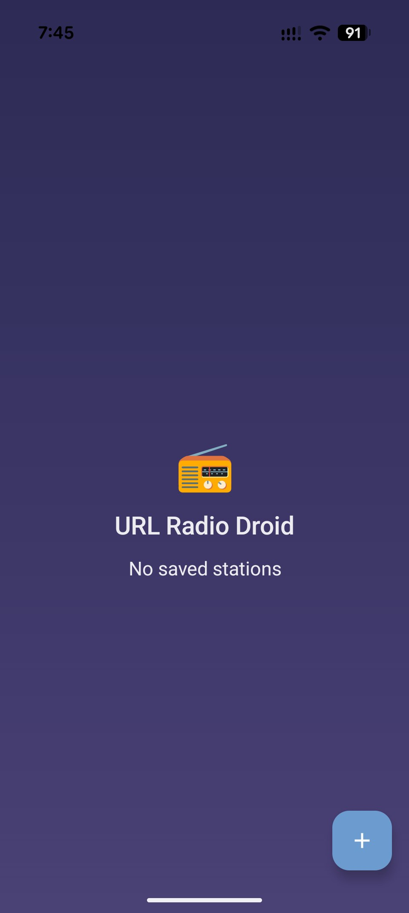
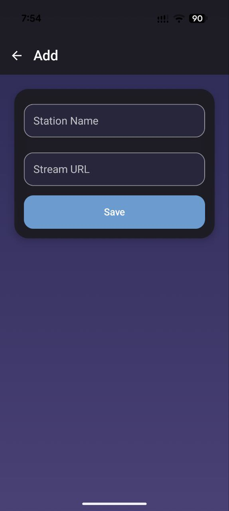
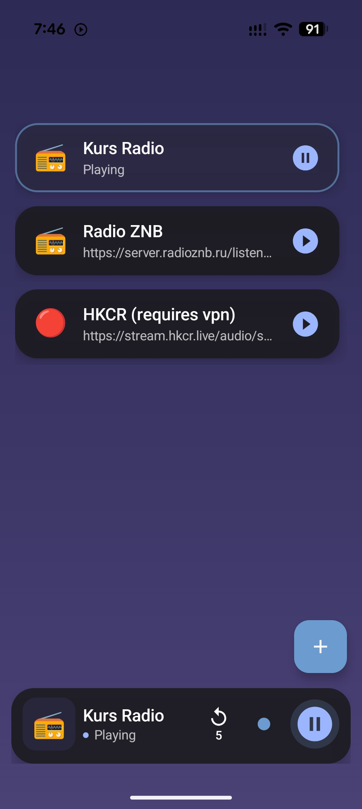

# 📻 URL Radio Droid

A minimalist Android application for listening to internet radio via direct streaming links (HTTP/HTTPS).

## 📸 Screenshots

<p align="center">
  
  
  
</p>

## ✨ Features

- 📍 Add radio stations with name and stream URL
- **🖼️ Custom station icons**: pick an emoji or upload your own image for any station, shown in the list and mini player
- **🔎 Discover stations**: search the [Radio Browser](https://api.radio-browser.info/) public directory by name, genre, or country and add results straight to your library, no need to hunt down stream URLs yourself
- 📜 View list of saved stations with search (when more than 4 stations)
- **⭐ Favorites / pinning**: tap the star on any station to pin it to the top of the list; pinned stations stay sorted above the rest
- **📱 App Shortcuts**: long-press the launcher icon for one-tap play of your last-played and favorite station, no need to open the app first
- ▶️ Play streams using ExoPlayer
- 🔇 Background playback support with media notifications
- **🎯 Unified player and list state**: the bottom mini player and the active list item always show the same station and play/pause state
- **🎵 Mini player**: always visible when a station is selected; play/pause; tap to open full playback screen
- **👆 Swipe to switch stations**: swipe left/right on the mini player to switch to previous/next station in the list; smooth slide animation
- **📊 Playback status**: Playing, Paused, Starting… (also when buffering), or Connection failed (after ~10 s if stream does not start, or immediately on invalid URL)
- **📡 HLS support**: `.m3u8` URLs are played via ExoPlayer’s HLS support (manifest + segments); no timeshift for HLS
- **⏪ Timeshift (rewind)**: for single-URL streams, rewind 5 seconds or jump back to live; live indicator shows when you are at the live edge
- **⚠️ Connection error handling**: invalid or unreachable stream URL shows "Connection failed" toast; app does not crash
- **🔁 Reliable background playback**: automatically resumes the last station if the system kills and restarts the app process; reconnects on network loss with capped exponential backoff (up to 5 attempts) instead of hammering the stream or retrying forever
- **🎶 Live track title**: shows the current track (from ICY/Shoutcast metadata, when the stream provides it) in the mini player and playback screen, with a one-tap copy-to-clipboard button
- **😴 Sleep timer**: stop playback automatically after 15/30/45/60 minutes, with a live countdown shown on the playback screen
- 💾 Local data storage using Room Database, with unique name/URL constraints enforced at the DB level and safe migrations (no data loss on upgrade)
- **📤 Export / share / import stations**: back up all your stations to a JSON file (favorite status included) or share it to another app, share a single station straight from its list item, and import a backup (e.g. after reinstalling or switching devices)
- 🎨 Modern UI with Jetpack Compose (liquid glass style)
- 🌐 Network availability check before playback
- ✔️ URL validation when adding stations, plus a live reachability check (HEAD/GET probe) before saving so a dead stream is caught immediately instead of failing the first time you hit play

## 📋 Requirements

- Android 10 (API 29) or higher
- Android Studio or compatible IDE
- Gradle 9.0+
- Java 24 (for compilation)

## 🔨 Building

1. Clone the repository or open the project in Android Studio
2. Sync Gradle dependencies
3. Build the project: `./gradlew build`
4. Install on device: `./gradlew installDebug`

## 📦 Releases

Installable APKs are published in the repo’s [Releases](releases) section when you push a version tag.

To publish a new release:

1. Create a version tag (e.g. `v1.0`):  
   `git tag v1.0`
2. Push the tag:  
   `git push origin v1.0`
3. On GitHub, open **Actions** — the **Release** workflow will run, build the APK, and create a release with the attached file `url-radiodroid-1.0.apk`.

Release APKs are built as a proper release build (R8 minification + resource shrinking enabled) and signed with a dedicated release keystore. The keystore itself isn't checked into the repo — it's stored base64-encoded in the `RELEASE_KEYSTORE_BASE64` GitHub Secret, decoded by the `Release` workflow at build time, alongside `RELEASE_KEYSTORE_PASSWORD`, `RELEASE_KEY_ALIAS`, and `RELEASE_KEY_PASSWORD`.

## 🚀 Usage

1. Launch the application
2. Tap the "Add" button (FAB) to add a station manually, or tap the **Discover** chip at the top of the list to search the Radio Browser directory by name/genre/country and add results directly
3. When adding manually, enter station name and stream URL (e.g. `http://stream.example.com:8000/stream` or `https://example.com/stream.m3u8` for HLS)
4. Tap "Save" — the URL is checked for reachability before it's stored
5. Tap a station in the list to play (or tap Play on a station card)
6. Use the bottom mini player: tap for full playback screen; use Play/Pause; swipe left/right to switch to previous/next station
7. **Timeshift** (single-URL streams only): while playing, use the rewind (↺ 5) button to go back 5 seconds; use the Live (●) button to return to the live edge; the Live indicator is bright when at live, dim when in the past
8. **Sleep timer**: on the playback screen, tap the sleep timer chip and pick a duration; tap again to see the countdown or cancel it
9. Playback continues in background with media notification, and resumes automatically if the system needs to kill the app process

## ⏪ Timeshift (rewind)

While a stream is playing, the app records it to a temporary buffer file (default cap ~30 MB). Playback reads from this file, so you can rewind within the buffered range:

- **Rewind 5 s**: jumps back 5 seconds (by reopening the source at the corresponding byte offset; ExoPlayer does not reliably honour `seekTo(ms)` for live-style progressive sources).
- **Live**: jumps to the current end of the buffer (live edge). The Live indicator (●) is bright when at live, dim when in the past.

Buffer file is created in app cache and removed when playback stops. **Timeshift is not used for HLS** (`.m3u8`): those streams are played directly; rewind/Live buttons are hidden.

## 📤 Export / Share / Import Stations

Overflow menu (⋮) on the main screen:

- **Export stations**: sends a JSON backup of *all* your stations (name, stream URL, custom icon) via the system share sheet — pick Telegram, WhatsApp, email, "Save to Files", etc.
- **Import stations**: reads a previously exported/shared JSON file and adds any stations that aren't already in your list (stations with a name or URL that already exists are skipped, not overwritten).

Swipe left on a single station in the list to reveal **Edit / Share / Delete** — Share sends just that one station as its own JSON file (named after the station), so you can quickly send one station to a friend without exporting your whole list. Delete is immediate (no confirmation dialog), but a Snackbar with an **Undo** action lets you restore the station if you tap it by mistake.

This is a convenient way to back up your list before reinstalling the app, move it to another device, or send stations to yourself/a friend.

## 🗄️ Database Migrations

Station names and stream URLs are unique at the database level (not just checked in the UI), and schema changes ship as real Room `Migration`s rather than wiping the database — installed schema versions are checked into [`app/schemas/`](app/schemas/) so every upgrade path can be tested. If you change the `RadioStation` entity or `AppDatabase`, bump the version and add a corresponding `Migration` (see `AppDatabase.MIGRATION_2_3` for a dedupe-then-constrain migration, or `MIGRATION_3_4` for a simple added-column migration) — don't rely on destructive fallback except for very old installs with no schema snapshot to migrate from.

## 🛠 Technologies

- **Kotlin** - primary development language
- **Jetpack Compose** - UI toolkit
- **AndroidX** - support libraries
- **Room Database** - local database for stations
- **Media3 (ExoPlayer)** - audio stream playback; HLS (m3u8) and progressive; custom DataSource for timeshift buffer
- **OkHttp** - stream recording for timeshift (buffer file)
- **Coroutines & StateFlow** - state and async operations
- **KSP** - Room annotation processing
- **MediaSession** - integration with Android media playback system

## 📁 Project Structure

```
app/src/main/
├── java/com/urlradiodroid/
│   ├── data/
│   │   ├── RadioStation.kt          # Entity for radio station
│   │   ├── RadioStationDao.kt       # DAO for database operations
│   │   ├── RadioStationRepository.kt # Data access + JSON export/import
│   │   ├── StationBackupJson.kt     # Shared station <-> JSON serialization
│   │   ├── RadioBrowserApi.kt       # Client for the Radio Browser directory (station search)
│   │   └── AppDatabase.kt           # Room database + migrations (schemas checked into app/schemas/)
│   ├── ui/
│   │   ├── MainScreen.kt            # Main screen (Compose) with list and mini player
│   │   ├── MainViewModel.kt         # State: stations, search, current playing station
│   │   ├── AddStationScreen.kt      # Add/edit station screen
│   │   ├── AddStationViewModel.kt   # Form state, validation, reachability check, save (UiState + events channel)
│   │   ├── DiscoverStationsScreen.kt    # Search the Radio Browser directory, add results to the library
│   │   ├── DiscoverStationsViewModel.kt # Debounced search state, add/duplicate handling
│   │   ├── PlaybackScreen.kt        # Full playback screen (track title, sleep timer)
│   │   ├── RadioPlaybackService.kt  # Background playback service (retry backoff, sleep timer)
│   │   ├── playback/
│   │   │   ├── StreamRecorder.kt        # Records stream to buffer file (OkHttp), parses ICY metadata
│   │   │   ├── LiveFileDataSource.kt    # Media3 DataSource: read buffer, block at EOF
│   │   │   ├── TimeshiftController.kt   # Buffer file lifecycle + seek math for rewind/live
│   │   │   └── PlaybackStateStore.kt    # Persists last station so playback can resume after process death
│   │   ├── components/
│   │   │   ├── NowPlayingBottomBar.kt  # Mini player: play/pause, rewind 5s, live, track title
│   │   │   ├── StationItem.kt          # Station list item (favorite toggle, swipe to edit/share/delete)
│   │   │   └── EqualizerBars.kt        # Animated "now playing" bars indicator
│   │   └── theme/                   # Compose theme (colors, typography)
│   └── util/
│       ├── EmojiGenerator.kt
│       ├── StreamValidator.kt       # HEAD/GET reachability probe before a station is saved
│       ├── AppShortcuts.kt          # Long-press launcher icon: last-played/favorite station shortcuts
│       └── StationShare.kt          # Share JSON backup via Intent.ACTION_SEND (FileProvider)
└── res/
    ├── values/                      # Strings, colors, themes
    └── drawable/                    # Icons
```

## 📚 Dependencies

Main project dependencies:

- `androidx.core:core-ktx:1.19.0`
- `androidx.appcompat:appcompat:1.7.1`
- `com.google.android.material:material:1.14.0`
- `androidx.compose.*` - Compose BOM
- `androidx.room:room-runtime:2.8.4` + `room-ktx:2.8.4`
- `androidx.media3:media3-exoplayer:1.10.1`
- `androidx.media3:media3-exoplayer-hls:1.10.1` (HLS / .m3u8)
- `androidx.media3:media3-ui:1.10.1`
- `androidx.media3:media3-session:1.10.1`
- `androidx.media3:media3-datasource:1.10.1` (custom DataSource for timeshift)
- `com.squareup.okhttp3:okhttp:5.4.0` (stream recording for timeshift buffer, ICY metadata)

## 🧪 Testing

The project includes unit tests for:

- **RadioStation** - data model equality and properties
- **RadioStationDao** - CRUD and ordering (favorites-first, in-memory database), unique constraint violations
- **AppDatabaseMigrationTest** - migration 2→3 preserves data, dedupes pre-existing collisions, enforces new unique constraints; migration 3→4 adds `isFavorite` defaulting to false
- **RadioStationRepositoryBackupTest** - JSON export/import (incl. `isFavorite`, with old-backup fallback), duplicate skipping, round-trip fidelity
- **StationBackupJson** - single-station and bulk JSON serialization shape
- **MainViewModel** - current playing station, search, delete, favorite toggling/reordering
- **UrlValidator** - URL validation (AddStationActivity)
- **StreamRecorder** / **TimeshiftController** / **StreamValidator** / **RadioBrowserApi** - recording, buffering, seek state, reachability probing, directory search parsing (via a local `MockWebServer`)
- **StationShare** - share-sheet intent (`ACTION_SEND`), file name sanitization, backup file contents
- **RadioPlaybackServiceLogicTest** - HLS detection, retry backoff, retryable-error classification
- **DiscoverStationsViewModel** - debounced search, duplicate/name-collision handling on add
- **AppShortcuts** - dynamic shortcut set for last-played/favorite station, dedup when they're the same station

Screenshot (pixel-diff) tests use [Roborazzi](https://github.com/takahirom/roborazzi) over Robolectric's native-graphics mode, catching visual regressions (clipped shadows, invisible text) that a plain unit test can't. Reference images live in `app/src/test/screenshots/` and are committed to the repo.

### Running Tests Locally

Run all unit tests:

```bash
./gradlew test
```

Run tests for a specific module:

```bash
./gradlew :app:test
```

View test results:

```bash
./gradlew test --info
```

Test results are available in `app/build/test-results/` directory.

Check screenshot tests against their committed baseline (also run in CI):

```bash
./gradlew verifyRoborazziDebug
```

After an intentional visual change, re-record the baseline and review the diff before committing:

```bash
./gradlew recordRoborazziDebug
```

## ✅ Code Quality

### Kotlin Linting (ktlint)

The project uses [ktlint](https://ktlint.github.io/) for code style checking and formatting.

Check code style:

```bash
./gradlew ktlintCheck
```

Auto-fix code style issues:

```bash
./gradlew ktlintFormat
```

## 🔄 CI/CD

GitHub Actions workflow automatically runs on every push and pull request:

- **Tests**: Runs all unit tests
- **Lint**: Checks Kotlin code style with ktlint
- **Build**: Builds the debug APK

View workflow status in the "Actions" tab of your GitHub repository.

## 🔐 Permissions

The application requests the following permissions:

- `INTERNET` - for stream playback
- `ACCESS_NETWORK_STATE` - for network availability check
- `FOREGROUND_SERVICE` + `FOREGROUND_SERVICE_MEDIA_PLAYBACK` - for background playback
- `POST_NOTIFICATIONS` - for media notifications (Android 13+)
- `WAKE_LOCK` - keeps the network alive while playing with the screen off (background listening is the app's whole point)

## 📄 License

Project created for personal use.
