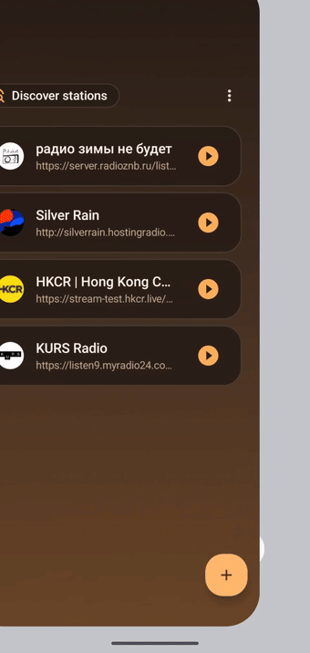

# 📻 Freqcast — Internet Radio Player

[](https://codecov.io/gh/z0rats/freqcast)

A modern open-source Android internet radio player that finds streams from station websites.

I built Freqcast because I couldn't find a radio app that stayed simple. Most alternatives either include ads, depend on proprietary station catalogs, or make adding custom stations harder than it should be.

Freqcast is fully local, requires no account, and works with standard HTTP/HTTPS streams and HLS. The goal is simple: if a station has a public stream, you should be able to listen to it without fighting the app.

### ✨ What makes it different?

Most radio apps expect you to manually find the actual stream URL.

Freqcast lets you paste the station's website instead. It first checks Radio Browser, then scans the website itself, discovers a playable stream, verifies that it works, and adds it to your library. In many cases, you never have to hunt for a .mp3, .aac, or .m3u8 URL yourself.

<p align="center">
  
</p>

## ✨ Features

- ➕ **Paste a station website instead of hunting for a stream URL** — Freqcast automatically discovers and verifies the playable stream whenever possible
- 🔎 **Discover stations** — search the Radio Browser directory by name, genre, country, language, or "near me", and add results straight to your library
- 🔁 Background playback with automatic reconnect
- ⏪ Timeshift for compatible streams
- 🎶 Live ICY metadata
- 😴 Sleep timer and multiple wake-up alarms
- 🏠 Home screen widget and Android Auto
- 📤 Import/export station lists (JSON, OPML, M3U, PLS)
- 📱 Tablet and foldable layouts
- 🌐 Localized into English, Russian, Spanish and Simplified Chinese

## Why Freqcast?

Internet radio is one of those technologies that has quietly survived for decades, but the Android ecosystem around it has become surprisingly fragmented.

I wanted a player that simply plays internet radio well, stores everything locally, supports modern Android APIs, and makes adding stations effortless—even when all you have is the station's homepage.

Freqcast started as that personal project and gradually evolved into a fully featured open-source player.

## 📲 Install on your phone

Grab the latest APK from the [Releases](../../releases) page and install it — no Play Store listing. 🎉

Requires **Android 10 (API 29)** or higher.

## 🔨 Set up for development

1. 🧬 Clone the repo and open it in Android Studio (or use ./gradlew directly — the wrapper is committed)
2. ☕ Requires **JDK 24** and **Gradle 9.0+** (bundled via the wrapper)
3. 🏗️ Build: ./gradlew build, or ./gradlew installDebug to install on a connected device/emulator
4. 🧰 make wraps common tasks: make format, make lint, make test, make build, make check, make run

### 🧪 Testing & coverage

```bash
./gradlew test
./gradlew verifyRoborazziDebug
./gradlew koverHtmlReportDebug
```

📊 Coverage is uploaded to [Codecov](https://codecov.io/gh/z0rats/freqcast) on every push/PR (informational, not a merge gate). CI (.github/workflows/ci.yml) also runs ktlintCheck ✅ and builds the debug APK 🏗️ on every push/PR; release.yml builds and signs 🔏 a release APK on version tags.

## 🔐 Permissions

| Permission | Why |
|---|---|
| INTERNET, ACCESS_NETWORK_STATE | 🌐 stream playback, connectivity checks |
| FOREGROUND_SERVICE, FOREGROUND_SERVICE_MEDIA_PLAYBACK | 🔁 background playback |
| POST_NOTIFICATIONS | 🔔 media notification (Android 13+) |
| WAKE_LOCK | 🔋 keep the network alive while playing with the screen off |
| RECEIVE_BOOT_COMPLETED, SCHEDULE_EXACT_ALARM | ⏰ wake-up alarms survive reboot and fire at the exact time |
| ACCESS_COARSE_LOCATION | 📍 only used for Discover's "near me" search; sent for that one search, never stored |

## 💖 Support

If you'd like to support development, see [FUNDING.md](FUNDING.md) (Boosty / crypto).

## 📄 License

Licensed under [PolyForm Noncommercial 1.0.0](LICENSE) — free to view, fork, and modify for any noncommercial purpose. Commercial use requires the licensor's permission; contact via [FUNDING.md](FUNDING.md) or open an issue.
